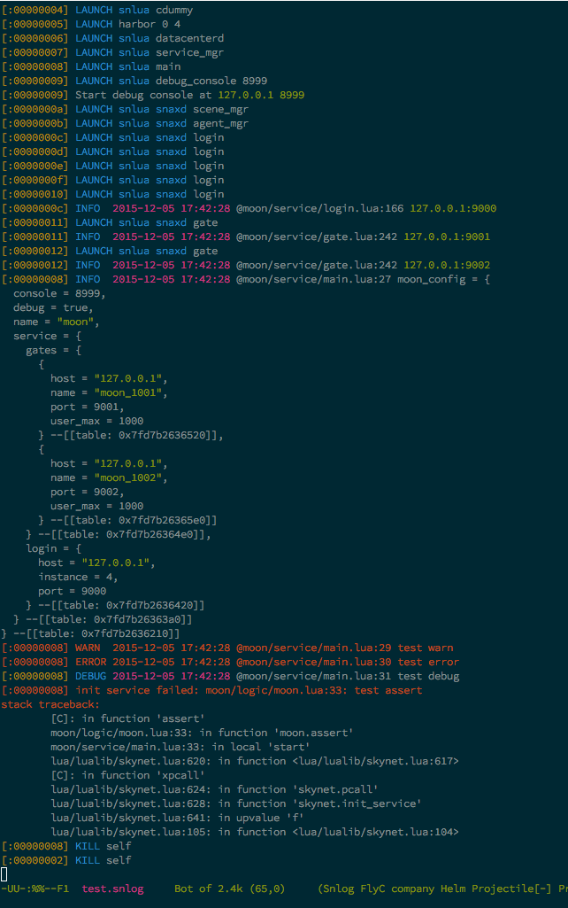

snlog-mode
==========

> Emacs major mode to view [skynet](https://github.com/cloudwu/skynet) log



How to Install
--------------

Put `snlog-mode.el` in Emacs load-path, and add this line to your .emacs file:

```lisp
(require 'snlog-mode)
(add-to-list 'auto-mode-alist '("\\.snlog\\'" . snlog-mode))
```
